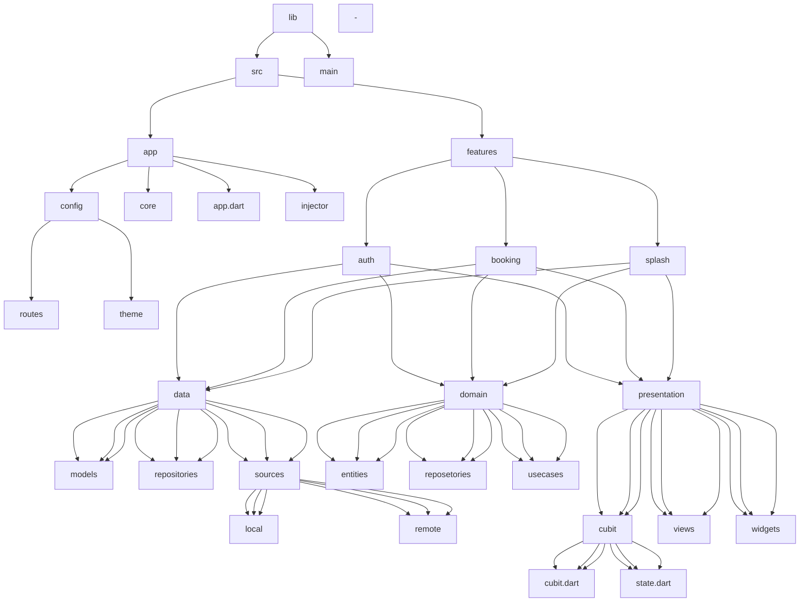

Architecture Flow diagrame :

<<<<<<< HEAD
## features

## Architecture

- 

Resource for Architecture 

   - <a href="https://devmuaz.medium.com/flutter-clean-architecture-series-part-1-d2d4c2e75c47" > clean architecture article</a>
  
  -

- 

The architecture folders 

=======

>>>>>>> 0543b476d6fc164ba0584d9579224ee7bf2e3bd6
