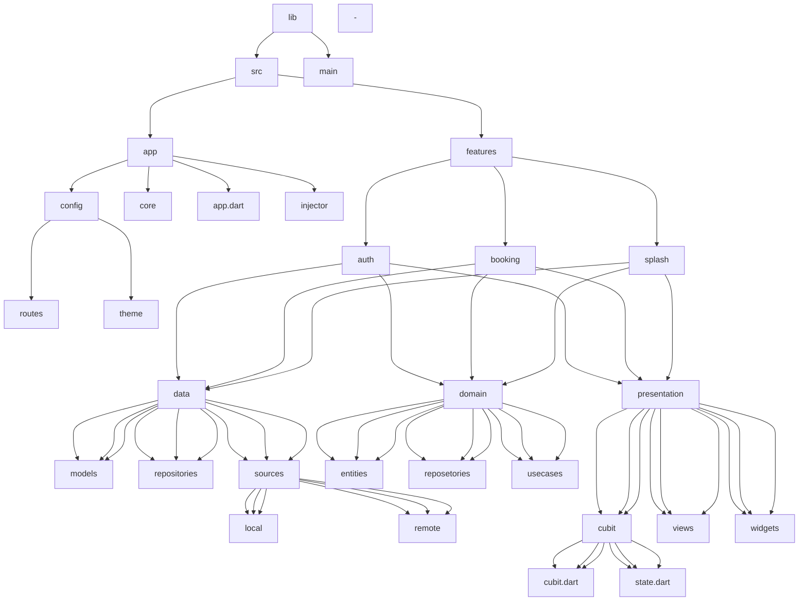

## features

## Architecture

- 

Resource for Architecture 

   - <a href="https://devmuaz.medium.com/flutter-clean-architecture-series-part-1-d2d4c2e75c47" > clean architecture article</a>
  
  -

# The architecture folders 

<ul>
  <li> lib -->src 
       -->main</li>
      <li>src --->app --->features</li>
     <li> app -->config -->core  -->app.dart  -->injector</li>
     <li> config --->routes --->theme</li>
     <li> features --->auth<ul> -----------------
      <li>auth ---->data ---->domain ---->presentation</li>
     <ul><li> data --->models --->repositories --->sources</li>
     <li> sources -->local -->remote</li>
     <li> domain --->entities --->reposetories --->usecases</li>
     <li> presentation ---->cubit ---->views ---->widgets</li>
        <li>cubit -->cubit.dart -->state.dart</li></ul>
        </ul>  --->booking<ul> -----------------
      <li>booking ---->data ---->domain ---->presentation</li>
     <ul><li> data --->models --->repositories --->sources</li>
     <li> sources -->local -->remote</li>
     <li> domain --->entities --->reposetories --->usecases</li>
     <li> presentation ---->cubit ---->views ---->widgets</li>
        <li>cubit -->cubit.dart -->state.dart</li></ul>
        </ul>   --->splash<ul> -----------------
      <li>splash ---->data ---->domain ---->presentation</li>
     <ul><li> data --->models --->repositories --->sources</li>
     <li> sources -->local -->remote</li>
     <li> domain --->entities --->reposetories --->usecases</li>
     <li> presentation ---->cubit ---->views ---->widgets</li>
        <li>cubit -->cubit.dart -->state.dart</li></ul>
        </ul> </li>
   -
   
</ul>
 

# Architecture Flow diagrame :

