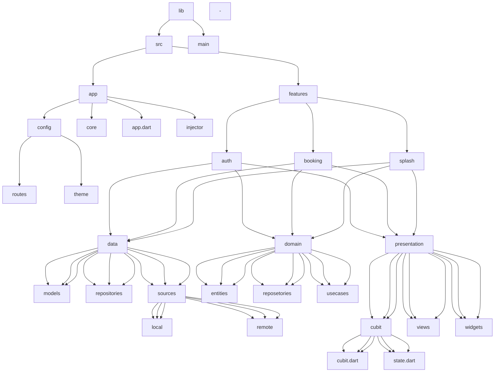

Architecture Flow diagrame :

```mermaid
graph TD;
    lib-->src;
    lib-->main;
    src--->app
    src--->features
    app-->config
    app-->core
    app-->app.dart
    app-->injector
    config--->routes
    config--->theme
    features--->auth
    features--->booking
    features--->splash
    -
    auth---->data
    auth---->domain
    auth---->presentation
    data--->models
    data--->repositories
    data--->sources
    sources-->local
    sources-->remote
    domain--->entities
    domain--->reposetories
    domain--->usecases
    presentation---->cubit
    presentation---->views
    presentation---->widgets
    cubit-->cubit.dart
    cubit-->state.dart
    -
    booking---->data
    booking---->domain
    booking---->presentation
    data--->models
    data--->repositories
    data--->sources
    sources-->local
    sources-->remote
    domain--->entities
    domain--->reposetories
    domain--->usecases
    presentation---->cubit
    presentation---->views
    presentation---->widgets
    cubit-->cubit.dart
    cubit-->state.dart
    -
    splash---->data
    splash---->domain
    splash---->presentation
    data--->models
    data--->repositories
    data--->sources
    sources-->local
    sources-->remote
    domain--->entities
    domain--->reposetories
    domain--->usecases
    presentation---->cubit
    presentation---->views
    presentation---->widgets
    cubit-->cubit.dart
    cubit-->state.dart
    
     
```
